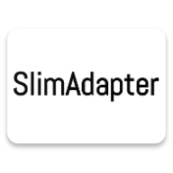

[  ](https://bintray.com/idik-net/SlimAdapter/SlimAdapter/_latestVersion)
[](https://raw.githubusercontent.com/MEiDIK/SlimAdapter/master/LICENSE)
[](http://developer.android.com/index.html)


# First At A Glance :)


# Intro





A slim &amp; clean &amp; typeable Adapter without# VIEWHOLDER

# Features

* No ViewHolder any more
* No Reflection
* Fluent & simple API
* Multi-typeable adapter
* Auto DiffUtils
* Auto LoadMore
* Support kotlin

### Ex Features

* Add Header & Footer Unlimitly
* Auto emptyState with emptyView


# Setup
```java
compile 'net.idik:slimadapter:2.1.1'
```

# Usages

## Java

#### Step 0: Create SlimAdapter
```java
SlimAdapter.create()
SlimAdapter.create(SlimAdapterEx.class) //For ex features if need

```


#### Step 1: register data types & attachTo target RecyclerView

* register(layoutRes, SlimInjector\<DataType\>)

  Register a DataType to be associated with a layoutRes through a SlimInjector
 
* registerDefault(layoutRes, SlimInjector)

  Register a default layoutRes to all the DataType which has not registered by alone.

```java        

 SlimAdapter.create()
                .register(R.layout.item_user, new SlimInjector<User>() {
                    @Override
                    protected void onInject(User data, IViewInjector injector) {
                        ...// inject data into views，step 2
                    }
                })
                .register(R.layout.item_interger, new SlimInjector<Integer>() {
                    @Override
                    protected void onInject(Integer data, IViewInjector injector) {
                        ...// inject data into views，step 2
                    }
                })
                .register(R.layout.item_string, new SlimInjector<String>() {
                    @Override
                    protected void onInject(String data, IViewInjector injector) {
                        ...// inject data into views，step 2
                    }
                })
                .registerDefault(R.layout.item_string, new SlimInjector() {
                    @Override
                    protected void onInject(Object data, IViewInjector injector) {
                        ...// inject data into views，step 2
                    }
                })
                .attachTo(recyclerView);
    }
    
```


#### Step 2: Inject data into views with fluent apis

```java
injector.text(R.id.name, data.getName())
        .text(R.id.age, String.valueOf(data.getAge()))
        .textColor(R.id.age, Color.RED)
        .textSize(R.id.age, 8)
        .longClicked(R.id.name, new View.OnLongClickListener() {
                                    @Override
                                    public boolean onLongClick(View v) {
                                        //do stuff...
                                        return false;
                                    }
                                })
        .clicked(R.id.text, new View.OnClickListener() {
                                    @Override
                                    public void onClick(View v) {
                                        //do stuff...
                                    }
                                })
        .with(R.id.name, new IViewInjector.Action<TextView>() {
                                    @Override
                                    public void action(TextView view) {
                                        //do stuff...
                                    }
                                })
        ...;
```


#### Step 3: Use SlimAdapter as normal adapter

```Java
    List<Object> data = new ArrayList<>();

    {
        data.add(new SectionHeader("My Friends"));
        data.add(new User("Jack", 21, R.drawable.icon1, "123456789XX"));
        data.add(new User("Marry", 17, R.drawable.icon2, "123456789XX"));
        data.add(new SectionHeader("My Images"));
        data.add(new Image(R.drawable.cover1));
        data.add(new Image(R.drawable.cover2));
        data.add(new Image(R.drawable.cover3));
        data.add(new Image(R.drawable.cover4));
        data.add(new Image(R.drawable.cover5));
        data.add(new Image(R.drawable.cover6));
        data.add(new Image(R.drawable.cover7));
        data.add(new Image(R.drawable.cover8));
        data.add(new Image(R.drawable.cover9));
        data.add(new Image(R.drawable.cover10));
        data.add(new Image(R.drawable.cover11));
        data.add(new SectionHeader("My Musics"));
        data.add(new Music("Love story", R.drawable.icon3));
        data.add(new Music("Nothing's gonna change my love for u", R.drawable.icon4));
        data.add(new Music("Just one last dance", R.drawable.icon5));
    }
    
    slimAdapter.updateData(data);
    
```

## About SlimAdapterEx

SlimAdapter aims to be "Slim", not "Super", so the SlimAdapter core lib is focus on wrapping the RecycleAdapter to provide a more friendly api.

Anyway, Someone needs a more power Adpter, and this is the reason why SlimAdapterEx exsit. 

In a word, SlimAdapterEx is focus on providing some power feature in a slim way.


## SlimAdapter 💗 Kotlin

```Kotlin
SlimAdapter.create()
                .register<String>(R.layout.item_string) { data, injector ->
                    ...// inject data into views
                }
                .register<User>(R.layout.item_user) { data, injector ->
                    ...// inject data into views
                }
                .register<Int>(R.layout.item_interger) { data, injector ->
                    ...// inject data into views
                }
                .registerDefault(R.layout.item_string) { data, injector ->
                    ...// inject data into views
                }
                .attachTo(recyclerView)
```


--------------

<a href='https://bintray.com/idik-net/SlimAdapter/SlimAdapter?source=watch' alt='Get automatic notifications about new "SlimAdapter" versions'></a>


# License

    MIT License

    Copyright (c) 2017 认真的帅斌

    Permission is hereby granted, free of charge, to any person obtaining a copy
    of this software and associated documentation files (the "Software"), to deal
    in the Software without restriction, including without limitation the rights
    to use, copy, modify, merge, publish, distribute, sublicense, and/or sell
    copies of the Software, and to permit persons to whom the Software is
    furnished to do so, subject to the following conditions:

    The above copyright notice and this permission notice shall be included in all
    copies or substantial portions of the Software.

    THE SOFTWARE IS PROVIDED "AS IS", WITHOUT WARRANTY OF ANY KIND, EXPRESS OR
    IMPLIED, INCLUDING BUT NOT LIMITED TO THE WARRANTIES OF MERCHANTABILITY,
    FITNESS FOR A PARTICULAR PURPOSE AND NONINFRINGEMENT. IN NO EVENT SHALL THE
    AUTHORS OR COPYRIGHT HOLDERS BE LIABLE FOR ANY CLAIM, DAMAGES OR OTHER
    LIABILITY, WHETHER IN AN ACTION OF CONTRACT, TORT OR OTHERWISE, ARISING FROM,
    OUT OF OR IN CONNECTION WITH THE SOFTWARE OR THE USE OR OTHER DEALINGS IN THE
    SOFTWARE.
